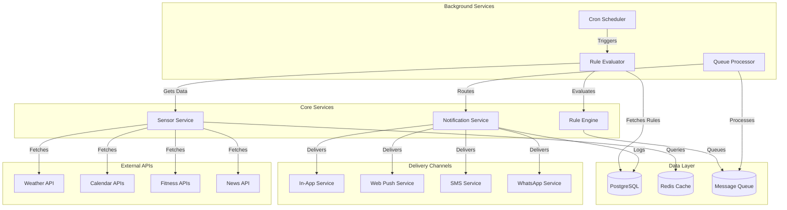
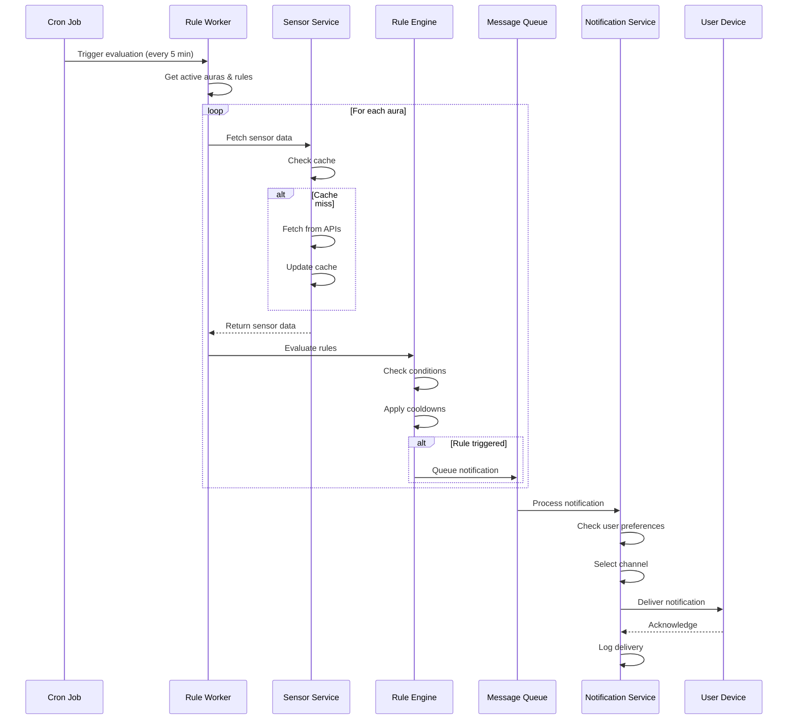

# Technical Specification: Proactive Notifications for Aura Platform

**Version:** 1.0  
**Date:** January 2025  
**Author:** Architecture Team  
**Status:** Draft

## Executive Summary

This document outlines the technical implementation for enabling auras to proactively send notifications when behavior rules are triggered, without requiring user-initiated interaction. The system will monitor sensor data, evaluate rules, and deliver notifications through multiple channels, starting with in-app messaging.

## Table of Contents

1. [Problem Statement](#problem-statement)
2. [Solution Overview](#solution-overview)
3. [System Architecture](#system-architecture)
4. [Database Design](#database-design)
5. [Component Specifications](#component-specifications)
6. [API Design](#api-design)
7. [Implementation Phases](#implementation-phases)
8. [Security Considerations](#security-considerations)
9. [Performance Requirements](#performance-requirements)
10. [Testing Strategy](#testing-strategy)
11. [Monitoring & Observability](#monitoring--observability)
12. [Risk Assessment](#risk-assessment)

## Problem Statement

### Current Limitations
- **Reactive-only system**: Rules only trigger during user-initiated conversations
- **No background processing**: No infrastructure for continuous rule evaluation
- **Missed opportunities**: Important events (weather changes, calendar reminders) go unnoticed
- **Limited engagement**: Users must remember to check in with their auras

### User Impact
- Users miss timely notifications (e.g., "dance in the rain" when it starts raining)
- Reduced value from sensor integrations
- Lower engagement with aura companions
- Inability to provide proactive assistance

## Solution Overview

### Core Capabilities
1. **Background Rule Evaluation**: Continuous monitoring of sensor data against user-defined rules
2. **Multi-Channel Delivery**: Notifications via in-app chat, web push, SMS, and WhatsApp
3. **Smart Scheduling**: Respect user preferences, quiet hours, and notification fatigue
4. **Tiered Access**: Different capabilities based on subscription level

### Success Metrics
- **Notification Delivery Rate**: >95% successful delivery
- **Response Time**: <5 seconds from trigger to notification
- **User Engagement**: 40% increase in aura interactions
- **Rule Effectiveness**: 70% of notifications marked as helpful

## System Architecture

### High-Level Architecture



### Component Interaction Flow



## Database Design

### New Tables

```sql
-- Stores proactive messages sent by auras
CREATE TABLE proactive_messages (
    id UUID PRIMARY KEY DEFAULT gen_random_uuid(),
    aura_id UUID NOT NULL REFERENCES auras(id) ON DELETE CASCADE,
    rule_id UUID REFERENCES behavior_rules(id) ON DELETE SET NULL,
    conversation_id UUID REFERENCES conversations(id) ON DELETE CASCADE,
    message TEXT NOT NULL,
    trigger_data JSONB NOT NULL, -- Sensor values that triggered the rule
    metadata JSONB DEFAULT '{}',
    created_at TIMESTAMP WITH TIME ZONE DEFAULT NOW(),
    delivered_at TIMESTAMP WITH TIME ZONE,
    read_at TIMESTAMP WITH TIME ZONE,
    status TEXT NOT NULL DEFAULT 'pending' CHECK (status IN ('pending', 'queued', 'delivered', 'read', 'failed', 'expired')),
    delivery_channel TEXT NOT NULL DEFAULT 'in_app' CHECK (delivery_channel IN ('in_app', 'web_push', 'sms', 'whatsapp', 'email')),
    retry_count INTEGER DEFAULT 0,
    error_message TEXT,
    
    INDEX idx_proactive_messages_aura_id (aura_id),
    INDEX idx_proactive_messages_status (status),
    INDEX idx_proactive_messages_created_at (created_at DESC)
);

-- Tracks rule execution history for cooldowns and analytics
CREATE TABLE rule_execution_log (
    id UUID PRIMARY KEY DEFAULT gen_random_uuid(),
    rule_id UUID NOT NULL REFERENCES behavior_rules(id) ON DELETE CASCADE,
    aura_id UUID NOT NULL REFERENCES auras(id) ON DELETE CASCADE,
    executed_at TIMESTAMP WITH TIME ZONE DEFAULT NOW(),
    triggered BOOLEAN NOT NULL DEFAULT FALSE,
    sensor_values JSONB NOT NULL,
    evaluation_result JSONB, -- Details about why rule did/didn't trigger
    notification_sent BOOLEAN DEFAULT FALSE,
    notification_id UUID REFERENCES proactive_messages(id),
    execution_time_ms INTEGER, -- Performance tracking
    
    INDEX idx_rule_execution_log_rule_id (rule_id),
    INDEX idx_rule_execution_log_aura_id (aura_id),
    INDEX idx_rule_execution_log_executed_at (executed_at DESC)
);

-- User notification preferences per aura and channel
CREATE TABLE notification_preferences (
    id UUID PRIMARY KEY DEFAULT gen_random_uuid(),
    user_id UUID NOT NULL REFERENCES auth.users(id) ON DELETE CASCADE,
    aura_id UUID REFERENCES auras(id) ON DELETE CASCADE, -- NULL means global preference
    channel TEXT NOT NULL CHECK (channel IN ('in_app', 'web_push', 'sms', 'whatsapp', 'email')),
    enabled BOOLEAN DEFAULT TRUE,
    quiet_hours_enabled BOOLEAN DEFAULT FALSE,
    quiet_hours_start TIME,
    quiet_hours_end TIME,
    timezone TEXT DEFAULT 'UTC',
    max_per_day INTEGER, -- Rate limiting per channel
    priority_threshold INTEGER DEFAULT 5, -- Only send if rule priority >= threshold
    metadata JSONB DEFAULT '{}', -- Channel-specific settings (phone number, etc.)
    created_at TIMESTAMP WITH TIME ZONE DEFAULT NOW(),
    updated_at TIMESTAMP WITH TIME ZONE DEFAULT NOW(),
    
    UNIQUE(user_id, aura_id, channel),
    INDEX idx_notification_preferences_user_id (user_id)
);

-- Tracks notification delivery status across channels
CREATE TABLE notification_delivery_log (
    id UUID PRIMARY KEY DEFAULT gen_random_uuid(),
    notification_id UUID NOT NULL REFERENCES proactive_messages(id) ON DELETE CASCADE,
    channel TEXT NOT NULL,
    attempted_at TIMESTAMP WITH TIME ZONE DEFAULT NOW(),
    delivered_at TIMESTAMP WITH TIME ZONE,
    failed_at TIMESTAMP WITH TIME ZONE,
    error_message TEXT,
    external_id TEXT, -- ID from external service (Twilio, etc.)
    metadata JSONB DEFAULT '{}',
    
    INDEX idx_notification_delivery_log_notification_id (notification_id)
);

-- Web push subscriptions
CREATE TABLE push_subscriptions (
    id UUID PRIMARY KEY DEFAULT gen_random_uuid(),
    user_id UUID NOT NULL REFERENCES auth.users(id) ON DELETE CASCADE,
    endpoint TEXT NOT NULL UNIQUE,
    keys JSONB NOT NULL, -- p256dh and auth keys
    user_agent TEXT,
    created_at TIMESTAMP WITH TIME ZONE DEFAULT NOW(),
    last_used_at TIMESTAMP WITH TIME ZONE,
    
    INDEX idx_push_subscriptions_user_id (user_id)
);

-- Background job tracking
CREATE TABLE background_jobs (
    id UUID PRIMARY KEY DEFAULT gen_random_uuid(),
    job_type TEXT NOT NULL,
    status TEXT NOT NULL DEFAULT 'pending' CHECK (status IN ('pending', 'running', 'completed', 'failed')),
    started_at TIMESTAMP WITH TIME ZONE,
    completed_at TIMESTAMP WITH TIME ZONE,
    error_message TEXT,
    metadata JSONB DEFAULT '{}',
    created_at TIMESTAMP WITH TIME ZONE DEFAULT NOW(),
    
    INDEX idx_background_jobs_status (status),
    INDEX idx_background_jobs_created_at (created_at DESC)
);
```

### Modified Tables

```sql
-- Add fields to behavior_rules table
ALTER TABLE behavior_rules ADD COLUMN IF NOT EXISTS 
    last_triggered_at TIMESTAMP WITH TIME ZONE,
    trigger_count INTEGER DEFAULT 0,
    notification_template TEXT, -- Custom message template
    notification_channels TEXT[] DEFAULT ARRAY['in_app'];

-- Add fields to auras table
ALTER TABLE auras ADD COLUMN IF NOT EXISTS
    proactive_enabled BOOLEAN DEFAULT TRUE,
    last_evaluation_at TIMESTAMP WITH TIME ZONE;

-- Add fields to conversations table
ALTER TABLE conversations ADD COLUMN IF NOT EXISTS
    has_unread_proactive BOOLEAN DEFAULT FALSE,
    unread_proactive_count INTEGER DEFAULT 0;
```

## Component Specifications

### 1. Rule Evaluator Worker

**Location:** `/apps/web/lib/services/workers/rule-evaluator-worker.ts`

```typescript
interface RuleEvaluatorConfig {
  batchSize: number;          // Number of auras to process per batch
  evaluationTimeout: number;  // Max time per aura evaluation (ms)
  sensorDataTTL: number;     // Cache TTL for sensor data (seconds)
  maxRetries: number;        // Max retries for failed evaluations
}

class RuleEvaluatorWorker {
  constructor(config: RuleEvaluatorConfig);
  
  // Main entry point - called by cron
  async execute(): Promise<WorkerResult>;
  
  // Process a batch of auras
  private async processBatch(auraIds: string[]): Promise<BatchResult>;
  
  // Evaluate rules for a single aura
  private async evaluateAuraRules(auraId: string): Promise<EvaluationResult>;
  
  // Fetch and cache sensor data
  private async fetchSensorData(aura: Aura): Promise<SensorData>;
  
  // Check if rule should trigger based on cooldowns
  private async shouldTrigger(rule: BehaviorRule, lastExecution: RuleExecution): boolean;
  
  // Queue notification for delivery
  private async queueNotification(rule: BehaviorRule, context: RuleContext): Promise<void>;
}
```

### 2. Notification Service

**Location:** `/apps/web/lib/services/notification-service.ts`

```typescript
interface NotificationPayload {
  auraId: string;
  ruleId: string;
  message: string;
  priority: number;
  channels: NotificationChannel[];
  context: Record<string, any>;
}

class NotificationService {
  // Queue a notification for delivery
  async queue(payload: NotificationPayload): Promise<string>;
  
  // Process queued notifications
  async processQueue(): Promise<ProcessResult>;
  
  // Route notification to appropriate channel
  private async route(notification: QueuedNotification): Promise<void>;
  
  // Check user preferences and quiet hours
  private async checkDeliveryConstraints(userId: string, channel: string): Promise<boolean>;
  
  // Deliver via specific channel
  async deliverInApp(notification: Notification): Promise<DeliveryResult>;
  async deliverWebPush(notification: Notification): Promise<DeliveryResult>;
  async deliverSMS(notification: Notification): Promise<DeliveryResult>;
  async deliverWhatsApp(notification: Notification): Promise<DeliveryResult>;
  
  // Handle delivery failures
  private async handleFailure(notification: Notification, error: Error): Promise<void>;
}
```

### 3. Sensor Data Service

**Location:** `/apps/web/lib/services/sensor-data-service.ts`

```typescript
interface SensorDataService {
  // Fetch all sensor data for an aura
  async fetchAll(aura: Aura): Promise<SensorDataMap>;
  
  // Fetch specific sensor data
  async fetchWeather(location: Location): Promise<WeatherData>;
  async fetchCalendar(connectionId: string): Promise<CalendarData>;
  async fetchFitness(connectionId: string): Promise<FitnessData>;
  async fetchNews(preferences: NewsPreferences): Promise<NewsData>;
  
  // Cache management
  async getCached(key: string): Promise<any | null>;
  async setCached(key: string, data: any, ttl: number): Promise<void>;
  
  // Batch fetch for efficiency
  async batchFetch(requests: SensorRequest[]): Promise<SensorDataMap[]>;
}
```

### 4. In-App Messenger

**Location:** `/apps/web/lib/services/channels/in-app-messenger.ts`

```typescript
class InAppMessenger implements NotificationChannel {
  // Deliver a proactive message
  async deliver(notification: Notification): Promise<DeliveryResult>;
  
  // Create or get existing conversation
  private async ensureConversation(auraId: string): Promise<string>;
  
  // Add message to conversation
  private async addMessage(conversationId: string, message: ProactiveMessage): Promise<void>;
  
  // Update unread counts
  private async updateUnreadStatus(conversationId: string): Promise<void>;
  
  // Trigger real-time update
  private async notifyClient(userId: string, update: RealtimeUpdate): Promise<void>;
}
```

## API Design

### REST Endpoints

#### Notification Preferences

```typescript
// GET /api/notifications/preferences
// Get user's notification preferences
interface GetPreferencesResponse {
  global: NotificationPreference[];
  byAura: Record<string, NotificationPreference[]>;
}

// PUT /api/notifications/preferences
// Update notification preferences
interface UpdatePreferencesRequest {
  auraId?: string;  // Optional - if not provided, updates global
  channel: NotificationChannel;
  settings: {
    enabled: boolean;
    quietHours?: {
      enabled: boolean;
      start: string;  // HH:MM
      end: string;    // HH:MM
      timezone: string;
    };
    maxPerDay?: number;
    priorityThreshold?: number;
  };
}

// POST /api/notifications/test
// Send a test notification
interface TestNotificationRequest {
  auraId: string;
  channel: NotificationChannel;
  message: string;
}
```

#### Notification History

```typescript
// GET /api/notifications/history
// Get notification history
interface GetHistoryRequest {
  auraId?: string;
  status?: NotificationStatus;
  startDate?: string;
  endDate?: string;
  limit?: number;
  offset?: number;
}

interface GetHistoryResponse {
  notifications: ProactiveMessage[];
  total: number;
  hasMore: boolean;
}

// PATCH /api/notifications/:id/read
// Mark notification as read
interface MarkReadResponse {
  success: boolean;
  readAt: string;
}
```

#### Push Subscription

```typescript
// POST /api/notifications/push/subscribe
// Register push subscription
interface PushSubscribeRequest {
  subscription: PushSubscription;
  userAgent?: string;
}

// DELETE /api/notifications/push/unsubscribe
// Remove push subscription
interface PushUnsubscribeRequest {
  endpoint: string;
}
```

### WebSocket Events

```typescript
// Real-time notification events via Supabase Realtime
interface RealtimeNotificationEvent {
  type: 'proactive_message' | 'notification_delivered' | 'notification_read';
  auraId: string;
  conversationId?: string;
  notification?: ProactiveMessage;
  timestamp: string;
}

// Client subscription
const subscription = supabase
  .channel('notifications')
  .on('postgres_changes', {
    event: 'INSERT',
    schema: 'public',
    table: 'proactive_messages',
    filter: `user_id=eq.${userId}`
  }, handleNotification)
  .subscribe();
```

## Implementation Phases

### Phase 1: In-App Messaging (Weeks 1-2)

#### Week 1: Infrastructure
- [ ] Database schema creation and migration
- [ ] Redis setup for caching and queuing
- [ ] Basic rule evaluator worker
- [ ] Sensor data service with caching
- [ ] Notification service foundation

#### Week 2: Integration & UI
- [ ] In-app message delivery
- [ ] Conversation UI updates for proactive messages
- [ ] Unread indicators and badges
- [ ] Real-time updates via WebSocket
- [ ] Basic preference management UI

### Phase 2: Web Push Notifications (Weeks 3-4)

#### Week 3: Push Infrastructure
- [ ] Service worker implementation
- [ ] VAPID key generation and management
- [ ] Push subscription handling
- [ ] Notification formatting and rich content

#### Week 4: User Experience
- [ ] Permission request flow
- [ ] Notification grouping and stacking
- [ ] Click handling and deep linking
- [ ] Fallback for unsupported browsers

### Phase 3: External Channels (Weeks 5-6)

#### Week 5: SMS Integration
- [ ] Twilio account setup
- [ ] Phone number verification flow
- [ ] SMS delivery service
- [ ] Cost tracking and limits

#### Week 6: WhatsApp Integration
- [ ] WhatsApp Business API setup
- [ ] Template message creation
- [ ] Media message support
- [ ] Session management

### Phase 4: Optimization (Weeks 7-8)

#### Week 7: Performance & Scaling
- [ ] Batch processing optimization
- [ ] Distributed worker implementation
- [ ] Advanced caching strategies
- [ ] Database query optimization

#### Week 8: Intelligence & Analytics
- [ ] Smart scheduling based on user patterns
- [ ] Notification effectiveness tracking
- [ ] A/B testing framework
- [ ] Engagement analytics dashboard

## Security Considerations

### Data Protection
- **Encryption at rest**: All notification content encrypted in database
- **Encryption in transit**: TLS 1.3 for all API communications
- **PII handling**: Minimal PII storage, automatic cleanup after 30 days

### Access Control
- **Authentication**: JWT tokens for API access
- **Authorization**: Row-level security in Supabase
- **Rate limiting**: Per-user and per-IP limits

### Channel Security
- **Web Push**: VAPID authentication
- **SMS**: Twilio Verify for phone validation
- **WhatsApp**: End-to-end encryption

### Compliance
- **GDPR**: User consent, data portability, right to deletion
- **CCPA**: Privacy policy updates, opt-out mechanisms
- **CAN-SPAM**: Unsubscribe links in all communications

## Performance Requirements

### Latency Targets
- **Rule evaluation**: < 100ms per rule
- **Sensor data fetch**: < 500ms (cached), < 2s (fresh)
- **Notification queueing**: < 50ms
- **In-app delivery**: < 1s
- **Push delivery**: < 5s
- **SMS delivery**: < 10s

### Throughput Targets
- **Concurrent aura evaluations**: 100
- **Rules per second**: 1,000
- **Notifications per minute**: 10,000
- **API requests per second**: 500

### Resource Limits
- **Worker memory**: 512MB
- **Worker timeout**: 30 seconds
- **Cache size**: 1GB Redis
- **Queue size**: 100,000 messages

### Subscription Tier Limits

```typescript
const TIER_LIMITS = {
  free: {
    evaluationFrequency: 30 * 60 * 1000,  // 30 minutes
    maxNotificationsPerDay: 10,
    maxRulesPerAura: 3,
    channels: ['in_app'],
    sensorDataCacheTTL: 3600,  // 1 hour
    priority: 1  // Lowest priority in queue
  },
  personal: {
    evaluationFrequency: 15 * 60 * 1000,  // 15 minutes
    maxNotificationsPerDay: 50,
    maxRulesPerAura: 10,
    channels: ['in_app', 'web_push'],
    sensorDataCacheTTL: 1800,  // 30 minutes
    priority: 2
  },
  family: {
    evaluationFrequency: 5 * 60 * 1000,  // 5 minutes
    maxNotificationsPerDay: 200,
    maxRulesPerAura: 25,
    channels: ['in_app', 'web_push', 'sms'],
    sensorDataCacheTTL: 600,  // 10 minutes
    priority: 3
  },
  business: {
    evaluationFrequency: 60 * 1000,  // 1 minute
    maxNotificationsPerDay: -1,  // Unlimited
    maxRulesPerAura: -1,  // Unlimited
    channels: ['in_app', 'web_push', 'sms', 'whatsapp'],
    sensorDataCacheTTL: 300,  // 5 minutes
    priority: 4  // Highest priority
  }
};
```

## Testing Strategy

### Unit Tests

```typescript
// Rule Evaluator Tests
describe('RuleEvaluatorWorker', () => {
  test('evaluates simple weather rule correctly');
  test('respects cooldown periods');
  test('handles sensor data fetch failures');
  test('processes batch within timeout');
});

// Notification Service Tests
describe('NotificationService', () => {
  test('queues notifications correctly');
  test('respects user preferences');
  test('handles quiet hours across timezones');
  test('retries failed deliveries');
});
```

### Integration Tests

```typescript
// End-to-end flow tests
describe('Proactive Notification Flow', () => {
  test('weather change triggers notification');
  test('calendar event sends reminder');
  test('multiple rules trigger in priority order');
  test('notification appears in conversation');
});
```

### Load Tests

```typescript
// Performance tests
describe('Load Testing', () => {
  test('handles 1000 concurrent aura evaluations');
  test('processes 10000 notifications per minute');
  test('maintains <100ms rule evaluation time under load');
});
```

### User Acceptance Tests

1. **Scenario: Rain Alert**
   - Given: User has "dance in rain" rule
   - When: Weather changes to rain
   - Then: User receives notification within 5 minutes

2. **Scenario: Meeting Reminder**
   - Given: User has calendar integration
   - When: Meeting is 15 minutes away
   - Then: Aura sends preparation reminder

3. **Scenario: Quiet Hours**
   - Given: User set quiet hours 10pm-7am
   - When: Rule triggers at 11pm
   - Then: Notification delayed until 7am

## Monitoring & Observability

### Key Metrics

```typescript
// Prometheus metrics
const metrics = {
  // Throughput
  'notifications_queued_total': Counter,
  'notifications_delivered_total': Counter,
  'notifications_failed_total': Counter,
  
  // Latency
  'rule_evaluation_duration_seconds': Histogram,
  'notification_delivery_duration_seconds': Histogram,
  'sensor_fetch_duration_seconds': Histogram,
  
  // System Health
  'worker_executions_total': Counter,
  'worker_failures_total': Counter,
  'cache_hit_ratio': Gauge,
  'queue_size': Gauge,
  
  // Business Metrics
  'rules_triggered_total': Counter,
  'user_engagement_rate': Gauge,
  'notification_read_rate': Gauge
};
```

### Logging

```typescript
// Structured logging with context
logger.info('Rule evaluation completed', {
  auraId,
  rulesEvaluated: ruleCount,
  rulesTriggered: triggeredCount,
  duration: evaluationTime,
  sensorData: sensorTypes
});
```

### Alerts

```yaml
# Prometheus alert rules
groups:
  - name: notification_alerts
    rules:
      - alert: HighNotificationFailureRate
        expr: rate(notifications_failed_total[5m]) > 0.05
        for: 10m
        annotations:
          summary: "High notification failure rate"
          
      - alert: WorkerExecutionSlow
        expr: rule_evaluation_duration_seconds > 5
        for: 5m
        annotations:
          summary: "Rule evaluation taking too long"
          
      - alert: QueueBacklog
        expr: queue_size > 10000
        for: 15m
        annotations:
          summary: "Notification queue backlog growing"
```

### Dashboard

```typescript
// Grafana dashboard configuration
const dashboard = {
  panels: [
    {
      title: 'Notification Delivery Rate',
      type: 'graph',
      targets: ['rate(notifications_delivered_total[5m])']
    },
    {
      title: 'Rule Evaluation Latency',
      type: 'heatmap',
      targets: ['rule_evaluation_duration_seconds']
    },
    {
      title: 'Active Auras',
      type: 'stat',
      targets: ['count(auras{proactive_enabled="true"})']
    },
    {
      title: 'Channel Distribution',
      type: 'piechart',
      targets: ['notifications_delivered_total by (channel)']
    }
  ]
};
```

## Risk Assessment

### Technical Risks

| Risk | Impact | Probability | Mitigation |
|------|--------|-------------|------------|
| API rate limits exceeded | High | Medium | Implement caching, batch requests, use webhooks where possible |
| Database performance degradation | High | Low | Index optimization, read replicas, connection pooling |
| Notification spam | High | Medium | Rate limiting, user preferences, smart batching |
| Worker failures | Medium | Medium | Retry logic, dead letter queue, monitoring |
| Cache invalidation issues | Low | High | TTL-based expiry, event-based invalidation |

### Business Risks

| Risk | Impact | Probability | Mitigation |
|------|--------|-------------|------------|
| User notification fatigue | High | High | Smart scheduling, preference controls, engagement tracking |
| Increased infrastructure costs | Medium | High | Tier-based limits, efficient caching, cost monitoring |
| Privacy concerns | High | Low | Clear consent, data minimization, encryption |
| Channel delivery failures | Medium | Medium | Multi-channel fallback, retry strategies |

### Mitigation Strategies

1. **Gradual Rollout**
   - Start with 10% of users
   - Monitor metrics closely
   - Increase gradually based on success

2. **Feature Flags**
   - Enable/disable per user
   - A/B testing capabilities
   - Quick rollback mechanism

3. **Fallback Mechanisms**
   - Queue overflow to S3
   - Degraded mode operation
   - Manual intervention tools

## Appendices

### A. Database Indexes

```sql
-- Performance-critical indexes
CREATE INDEX CONCURRENTLY idx_rules_aura_enabled 
  ON behavior_rules(aura_id) 
  WHERE enabled = true;

CREATE INDEX CONCURRENTLY idx_messages_unread 
  ON proactive_messages(aura_id, status) 
  WHERE status IN ('pending', 'delivered');

CREATE INDEX CONCURRENTLY idx_execution_log_recent 
  ON rule_execution_log(rule_id, executed_at DESC) 
  WHERE executed_at > NOW() - INTERVAL '24 hours';
```

### B. Environment Variables

```bash
# Worker Configuration
RULE_EVALUATION_INTERVAL=300000  # 5 minutes
RULE_EVALUATION_BATCH_SIZE=50
RULE_EVALUATION_TIMEOUT=30000

# Cache Configuration
REDIS_URL=redis://localhost:6379
SENSOR_DATA_CACHE_TTL=600
RULE_CACHE_TTL=300

# Notification Channels
ENABLE_IN_APP_NOTIFICATIONS=true
ENABLE_WEB_PUSH=false
ENABLE_SMS=false
ENABLE_WHATSAPP=false

# External Services
TWILIO_ACCOUNT_SID=xxx
TWILIO_AUTH_TOKEN=xxx
VAPID_PUBLIC_KEY=xxx
VAPID_PRIVATE_KEY=xxx

# Rate Limiting
MAX_NOTIFICATIONS_PER_USER_PER_DAY=100
MAX_RULES_PER_AURA=25
MIN_NOTIFICATION_INTERVAL=300  # 5 minutes
```

### C. Error Codes

```typescript
enum NotificationErrorCode {
  // Validation Errors (400x)
  INVALID_RULE = 4001,
  INVALID_SENSOR_DATA = 4002,
  MISSING_PREFERENCES = 4003,
  
  // Permission Errors (403x)
  TIER_LIMIT_EXCEEDED = 4031,
  CHANNEL_NOT_ALLOWED = 4032,
  QUIET_HOURS_ACTIVE = 4033,
  
  // Delivery Errors (500x)
  DELIVERY_FAILED = 5001,
  CHANNEL_UNAVAILABLE = 5002,
  EXTERNAL_SERVICE_ERROR = 5003,
  
  // System Errors (503x)
  WORKER_OVERLOADED = 5031,
  QUEUE_FULL = 5032,
  DATABASE_ERROR = 5033
}
```

## Conclusion

This specification provides a comprehensive blueprint for implementing proactive notifications in the Aura platform. The phased approach allows for incremental delivery of value while managing technical complexity and risk. Starting with in-app messaging provides immediate user benefit with minimal infrastructure changes, while the architecture supports future expansion to additional channels.

### Next Steps
1. Review and approve specification
2. Set up development environment
3. Create feature branch
4. Implement Phase 1 (In-App Messaging)
5. Deploy to staging for testing
6. Gradual production rollout

### Success Criteria
- 95% notification delivery rate
- <5 second end-to-end latency
- 40% increase in user engagement
- Zero critical security issues
- Positive user feedback score >4.0/5.0

---

**Document Version History**
- v1.0 (2025-01-13): Initial specification
- _Next: v1.1 - Post-review updates_